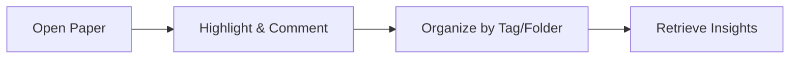

## Reading and Notetaking, Together

Efficient research often depends on your ability to read, annotate, and organize scientific papers—all without losing context or jumping between disjointed tools. Paperguide brings reading and notetaking into a single, streamlined workspace. By combining powerful annotation features with robust organizational tools, you can focus on understanding and synthesizing knowledge rather than managing files.

<Callout kind="info">

Paperguide lets you keep your notes, highlights, and comments always attached to the papers you’re reading. No more switching between tabs or hunting for stray annotations.

</Callout>

<Columns cols={3}>

<Card
  title="Highlight Key Points"
  href="#annotation-tools"
  icon="highlighter"
  cta="See Highlighting"
>
  
  Visually mark important sentences or figures directly within the PDF, making it easy to revisit key information later.

</Card>

<Card
  title="Add Comments"
  href="#annotation-tools"
  icon="message-square"
  cta="See Comments"
>
  
  Attach context-rich comments to sections, helping you summarize, question, or connect ideas as you read.

</Card>

<Card
  title="Organize by Tag or Folder"
  href="#organizing-notes"
  icon="folder"
  cta="See Organization"
>
  
  Group related annotations using tags and folders, ensuring everything stays discoverable and structured.

</Card>

</Columns>

## Why Annotate Papers in Context?

Keeping notes within the context of the source paper offers several benefits for academic work:

- You never lose track of which insight came from which article.
- Revisiting annotated papers later lets you quickly recall the main takeaways and your reflections.
- Sharing annotations promotes collaboration and transparency within research groups.
- Contextual organization speeds up writing, referencing, and literature reviews.

<Callout kind="tip">

Use Paperguide’s note and annotation features whenever you begin reading a new article—consistent in-context habits pay off over time.
</Callout>

## Annotation Tools Overview {#annotation-tools}

Paperguide integrates several annotation tools into the PDF reading workflow. Here’s how they work together to enhance your research:

<Tabs>
  <Tab title="Highlighting" icon="highlighter">
  
  Highlight passages to flag methods, conclusions, or anything you want to revisit. Highlights can be color-coded by theme or importance.
  
  ```bash
  # Example: Highlight text in Paperguide
  Click and drag to select text, then choose a highlight color from the toolbar.
  ```
  
  </Tab>
  
  <Tab title="Comments" icon="message-square">
  
  Add inline comments to any selected text. Comments let you summarize sections, ask questions, or note connections to other work.
  
  ```bash
  # Example: Add a comment
  Select text > "Comment" icon > Type your note > Save.
  ```
  
  </Tab>
  
  <Tab title="Tags & Folders" icon="folder">
  
  Assign tags to highlights or notes so you can search and filter them across your library. Move notes into folders for thematic organization.
  
  ```bash
  # Example: Tagging a note
  After creating a note, click "Add Tag", choose or create a tag, and apply it.
  ```
  
  </Tab>
</Tabs>

<ExpandableGroup>

<Expandable title="How do I review all my highlights in a paper?" default-open="false">

Use the annotation sidebar to view all highlights and notes made on a document, filter by tag, and jump to the relevant section in the PDF.

</Expandable>

<Expandable title="Can I export my annotations for use in other tools?" default-open="false">

You can export annotations and notes to formats like Markdown or CSV for use in your writing workflows or for sharing with collaborators.

</Expandable>

</ExpandableGroup>

## Typical Workflow: Annotating and Organizing as You Read

<Steps>

<Step title="Open a Reference" icon="book-open">

  
  Choose a paper from your [My References](/my-references/overview) library to start reading.

</Step>

<Step title="Highlight & Annotate" icon="highlighter">

  
  Select important passages and apply highlights. Add comments to elaborate or question findings as you go.

</Step>

<Step title="Organize by Tags & Folders" icon="tag">

  
  As you annotate, assign tags or move notes to folders using [Manage Tags](/my-references/manage-tags) and [Organising with Folders](/my-references/organising-with-folders). This keeps your research organized for easy retrieval.

</Step>

<Step title="Revisit and Synthesize" icon="refresh-ccw">

  
  Regularly revisit your annotations using the sidebar or search functions to synthesize insights and prepare for writing or review.

</Step>
</Steps>

## How Notes & Annotations Connect to Your Research Flow



<Callout kind="success">

Efficient annotation and in-context note-taking streamlines every stage of your research, from early exploration to final synthesis.

</Callout>

## Next Steps

- Visit the [My References Overview](/my-references/overview) to get started with your personal library.
- Learn about [Importing References](/my-references/importing-references) for fast setup.
- Explore [Manage Tags](/my-references/manage-tags) and [Organising with Folders](/my-references/organising-with-folders) to take your organizational system to the next level.