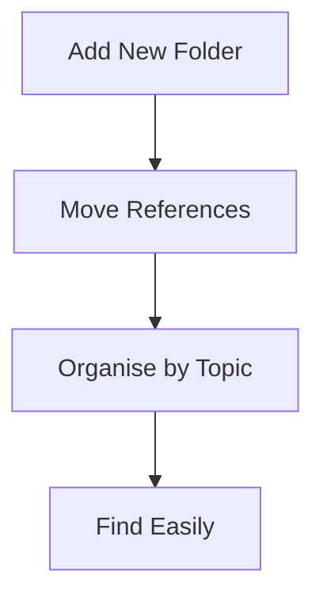

## 1. Introduction to Folder Organisation

Keeping research materials ordered can be challenging, especially as your collection grows. Paperguide’s Reference Manager offers powerful folder organisation features to help you sort references by project, topic, or priority.

<Callout kind="info">

Folders allow you to group references in whatever way works best for your workflow—by course, paper, theme, or any system you choose.

</Callout>

## 2. Accessing the Folder Panel

To start creating and managing folders, first open your Reference Manager.

<Image 
  src="https://paperguide-docs-static.s3.amazonaws.com/my-references/folders-overview.png"
  alt="Paperguide Reference Manager showing folders panel"
  width="800"
  height="400"
/>

**How to access the folder panel:**

- Log in to Paperguide and navigate to **My References** from the main menu.
- The left sidebar displays your folder structure.

## 3. Creating a New Folder

<Steps>

<Step title="Click the 'New Folder' Button" icon="folder-plus">

  
Locate and click the **New Folder** button in the sidebar. This opens a create dialog.
  

</Step>

<Step title="Name Your Folder" icon="edit3">

  
Enter an appropriate folder name (e.g. *Literature Review*, *Thesis Sources*).
  

</Step>

<Step title="Save the Folder" icon="check-circle">

  
Click **Create** (or **Save**) to add the folder to your list.
  

</Step>

</Steps>

<Callout kind="tip">

Name folders clearly and consistently for easier retrieval later. Consider including course codes or project names in folder titles.

</Callout>

## 4. Adding References to a Folder

You can move existing references into folders or add new ones directly.

<Columns cols={2}>

<Card 
  title="Move Existing Reference" 
  href="/my-references/importing-references"
  icon="arrow-right"
  cta="Learn more"
>

  
- Drag and drop a reference from the main list into your desired folder, or
- Use the reference **Actions** menu (**⋮**) and select **Move to Folder**.
  

</Card>

<Card 
  title="Add New Reference to a Folder"
  href="/adding-references"
  icon="folder-plus"
  cta="How to Add"
>

  
When adding a new reference, use the **Folder** dropdown to assign it immediately.
  

</Card>

</Columns>

## 5. Managing and Renaming Folders

<Tabs>

<Tab title="Rename" icon="edit3">

  
- Right-click the folder you wish to rename.
- Select **Rename** from the menu.
- Enter the new name and click **Save**.
  

</Tab>

<Tab title="Delete" icon="x-circle">

  
- Right-click the folder to remove.
- Select **Delete**.
- Confirm the deletion in the prompt.
  

</Tab>

<Tab title="Reorder" icon="chevron-right">

  
- Drag folders up or down in the sidebar to reorder them and suit your needs.
  

</Tab>

</Tabs>

<Callout kind="alert">

Deleting a folder will **not** delete the references inside. They will remain in your library under "All References" unless you explicitly remove them.

</Callout>

## 6. Folder Best Practices

<ExpandableGroup>

<Expandable title="Suggested Folder Structures" default-open="false">

  
- By research project (e.g. *Machine Learning Thesis*)
- By topic or subject area
- By document type (e.g. *Journal Articles*, *Conference Proceedings*)
  

</Expandable>

<Expandable title="Bulk Actions Supported" default-open="false">

  
- Move multiple references at once by selecting and dragging them to a folder.
- Select and delete multiple folders for large reorganisations.
  

</Expandable>

<Expandable title="Searching and Filtering" default-open="false">

  
Use the search bar above your folder list to quickly find specific folders or references.
  

</Expandable>

</ExpandableGroup>

## 7. Visual Reference: Folder Workflow

The diagram below outlines a typical workflow for using folders in Paperguide.

## 8. Frequently Asked Questions

<ExpandableGroup>

<Expandable title="Can I nest folders (use subfolders)?" default-open="false">

  
Currently, subfolders are not supported. All folders are at the same level for simplicity.
  

</Expandable>

<Expandable title="What happens if I delete a folder?" default-open="false">

  
References in a deleted folder are **not** deleted—they remain accessible in your main library.
  

</Expandable>

<Expandable title="Is there a maximum number of folders?" default-open="false">

  
Paperguide does not currently limit the number of folders you can create.
  

</Expandable>

</ExpandableGroup>

## 9. Next Steps

<Columns cols={2}>

<Card 
  title="Import References"
  href="/my-references/importing-references"
  icon="download"
  cta="Import now"
>
  
Learn how to add more references to your library.
  
</Card>

<Card 
  title="Explore Reference Manager"
  href="/my-references/overview"
  icon="book-open"
  cta="Get started"
>
  
See an overview of all features available in **My References**.
  
</Card>

</Columns>