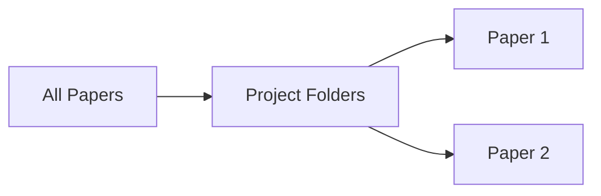

Paperguide allows you to efficiently organise your references into flexible, user-created folders. The folder system is accessible via the sidebar in **My References**, giving you an easy way to structure your research library for quick access and ongoing project management.

<Callout kind="info">
Folders in Paperguide are private and fully customizable—only you can view or modify your reference folders unless you choose to export or share selected items.
</Callout>

## Creating a New Folder

To create a new folder:

<Steps>
<Step title="Create a folder in My References" icon="folder" title-type="h3">
Click the <kbd>+</kbd> icon next to **All Papers** in the sidebar. Enter a folder name to add it instantly to your reference library.
</Step>
</Steps>

## Adding References

To add or import references:

You can bring new references into your library using Paperguide’s import options. Simply use the **Import** function within **My References** to add PDFs or citation files. For a full step-by-step workflow, see [Importing References](/my-references/importing-references).

<Columns cols="2">
<Card 
  title="Import from Zotero"
  href="/my-references/import-from-zotero"
  icon="download"
  cta="See guide"
>
Migrate entire collections from Zotero directly into Paperguide folders.
</Card>
<Card 
  title="Manual Entry"
  href="/adding-references"
  icon="file-plus"
  cta="Add individually"
>
Manually add single papers or reference entries for full flexibility.
</Card>
</Columns>

## Managing and Renaming Folders

Organise your references efficiently by managing folders as your research evolves.

<Tabs>
<Tab title="Move references" icon="arrow-right">
To move references from one folder to another, simply **drag and drop** the reference entry onto the destination folder in the sidebar. The reference will be reassigned immediately.
</Tab>
<Tab title="Rename folder" icon="edit">
Rename a folder by right-clicking its name in the sidebar and selecting **Rename**. Enter the new desired name and confirm.
</Tab>
<Tab title="Delete folder" icon="x-circle">
To remove a folder, right-click on its name and select **Delete**. Confirm the action to permanently delete the folder and all references only present in that folder.
</Tab>
<Tab title="Reorder folders" icon="list">
You can reorder folders by dragging them up or down in the sidebar to prioritise projects or research phases as you wish.
</Tab>
</Tabs>

<ExpandableGroup>
<Expandable title="Can I create nested folders?" default-open="false">
Currently, Paperguide supports a single folder hierarchy level. Multiple folders are allowed but subfolders (nested folders) are not supported yet.
</Expandable>
<Expandable title="Do deleted references disappear everywhere?" default-open="false">
Deleting a reference from its last folder will remove it from your entire Paperguide library. If a reference exists in multiple folders, removing it from one folder does not delete it from others.
</Expandable>
</ExpandableGroup>

## Best Practices

- Use distinctive folder names for different projects or research phases.
- Periodically review folders to archive completed projects.
- Maintain a small number of top-level folders for easy navigation.
- Use manual entry or import tools to keep your references up to date.

## Visual Workflow

Visualising reference and folder management in Paperguide:

## Frequently Asked Questions

<ExpandableGroup>
<Expandable title="Can I share folders or references with collaborators?" default-open="false">
Paperguide currently does not support direct folder sharing, but you can export references and share citation files or PDFs as needed.
</Expandable>
<Expandable title="Can I recover deleted folders?" default-open="false">
Deleted folders cannot be restored. Be sure before confirming deletion.
</Expandable>
</ExpandableGroup>

## Next Steps

<Columns cols="2">
<Card 
  title="Importing References"
  href="/my-references/importing-references"
  icon="download"
  cta="Learn how"
>
Read a comprehensive guide on bringing new references into your library.
</Card>
<Card 
  title="My References Overview"
  href="/my-references/overview"
  icon="file-text"
  cta="Overview"
>
Understand all features available in the My References area.
</Card>
</Columns>