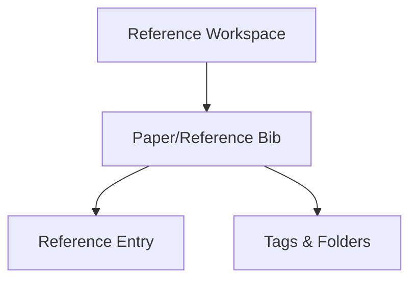

## Overview

Paperguide's Paper/Reference Bib feature unifies academic search, powerful writing tools, and reference management in a single streamlined interface for both individuals and research teams. It enables users to efficiently collect, organize, and cite bibliographic references for academic papers, journal articles, or collaborative group projects—all in one workspace.

<Callout kind="info" collapsed="false">
  Paperguide simplifies creating and managing bibliographic entries, helping you stay organized, automate citation formatting, and collaborate on shared reference libraries.
</Callout>

### Why Use Paper/Reference Bib?

- **Centralized Reference Organization:** Store all your sources in one place.

- **Easy Bibliography Creation:** Quickly generate formatted bibliographies for your projects.

- **Collaboration Ready:** Share and manage references with team members in real time.

- **Integrated Search & Writing:** Seamlessly add references while you research or write.

<Expandable title="How does Paper/Reference Bib compare to tools like Zotero?" default-open="false">
  Paperguide focuses on workflows that integrate research, writing, and reference management without frequent app switching. While tools like Zotero are excellent for large libraries and standalone management, Paperguide’s Paper/Reference Bib is designed for deep integration with your writing and team collaboration and includes built-in support for importing from Zotero.
</Expandable>

## Getting Started

Follow these steps to add and manage your Paper/Reference Bibs in Paperguide:

<Steps>
  <Step title="Open Your References Workspace" icon="book-open" title-type="p">
    Go to the **My References** section in Paperguide to view your personal or team reference collections.

    You may want to review the [Overview](/my-references/overview) page for a tour of this workspace.
  </Step>

  <Step title="Add a New Reference or Bib" icon="plus-circle" title-type="p">
    Click the **Add Reference** button. You can add entries manually, search for papers by title/DOI, or use import options.

    <Tabs>
      <Tab title="Manual Entry" icon="edit3">
        Fill in the bibliographic fields (such as author, title, year, publication) by typing the details directly.
      </Tab>

      <Tab title="Import from File" icon="download">
        Upload from supported reference formats (for example, BibTeX, RIS, EndNote). See [Importing References](/my-references/importing-references) for detailed instructions.
      </Tab>

      <Tab title="Import from Zotero" icon="folder-down">
        If you use Zotero, connect Paperguide to your Zotero library and select references to import directly. Refer to [Import from Zotero](/my-references/import-from-zotero).
      </Tab>
    </Tabs>
  </Step>

  <Step title="Organize & Manage Your References" icon="folder" title-type="p">
    Use folders and tags to group your references by project or topic. You can easily search, filter, and update entries within Paperguide.

    <Card title="Organising with Folders" href="/my-references/organising-with-folders" icon="folder" cta="Learn more about folders" horizontal="false">
      Discover ways to categorize your references for large projects or multiple teams.
    </Card>

    <Card title="Manage Tags" href="/my-references/manage-tags" icon="tag" cta="Add and manage tags" horizontal="false">
      Use tags for quick topic-based navigation across your reference library.
    </Card>
  </Step>
</Steps>

## Example: Adding a Reference (Manual Entry)

<CodeGroup show-lines="true" tabs={[]}>
  ```markdown
  **Manual:**  
  - Click "Add Reference"  
  - Enter fields: Author, Title, Year, Journal, DOI (if available)  
  - Save to Bib

  ```

  ```markdown
  **Auto-search:**  
  - Click "Add Reference"  
  - Enter paper title or DOI  
  - Select from suggested matches  
  - Confirm to add to Bib
  ```
</CodeGroup>

## Quick Bibliography Structure

Below is a simple illustration of how references are related in Paperguide:



<ExpandableGroup>
  <Expandable title="Can I share my Paper/Reference Bib with others?" default-open="false">
    Yes—Paperguide supports team collaboration. Invite team members to shared workspaces where everyone can add, edit, or comment on references.
  </Expandable>

  <Expandable title="What bibliographic formats are supported for import?" default-open="false">
    Paperguide supports common formats: BibTeX, RIS, EndNote XML, and direct import from Zotero.
  </Expandable>
</ExpandableGroup>

## Related Guides

<Columns cols="3">
  <Card title="Importing References" href="/my-references/importing-references" icon="download" cta="Import your collection" horizontal="false">
    Learn how to bulk import bibliographies from other reference managers.
  </Card>

  <Card title="Adding References" href="/adding-references" icon="folder" cta="See all methods" horizontal="false">
    Explore every way you can add references in Paperguide.
  </Card>

  <Card title="Organising with Folders" href="/my-references/organising-with-folders" icon="folder" cta="Organize by project" horizontal="false">
    Structure your library for faster access and collaboration.
  </Card>
</Columns>

